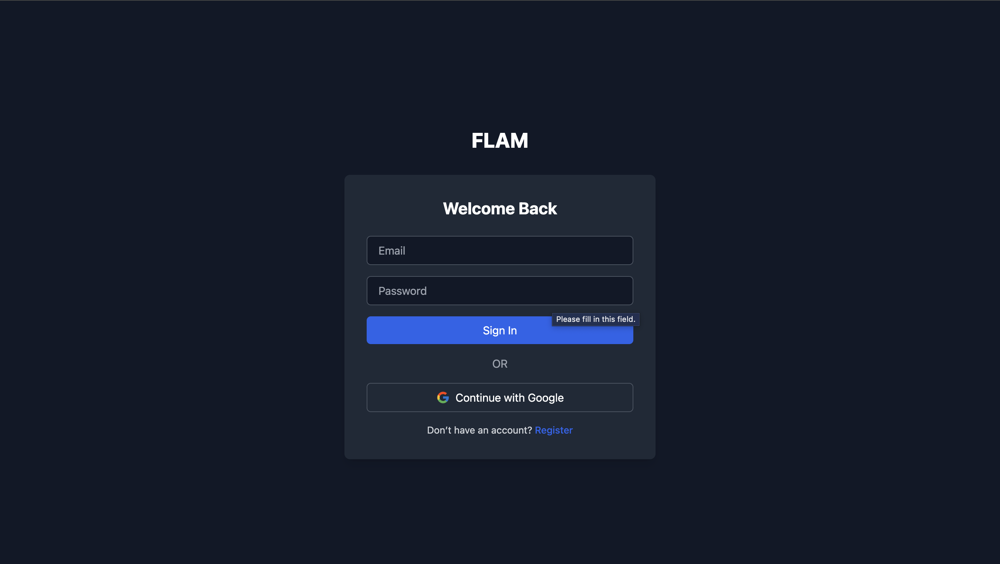
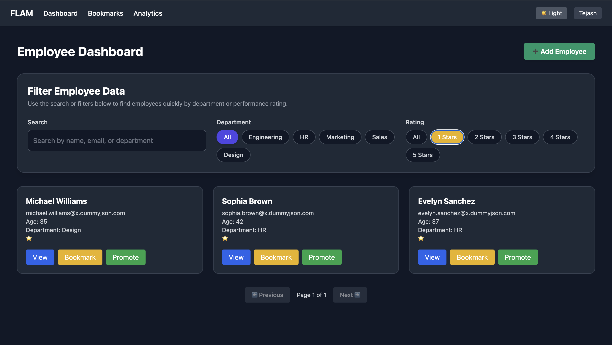
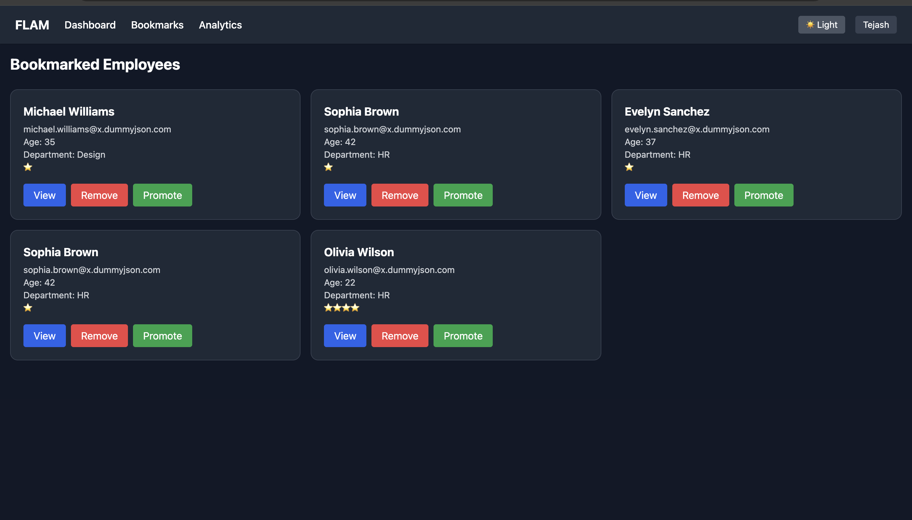
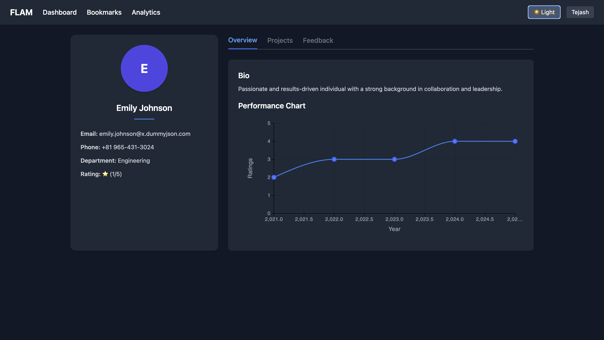
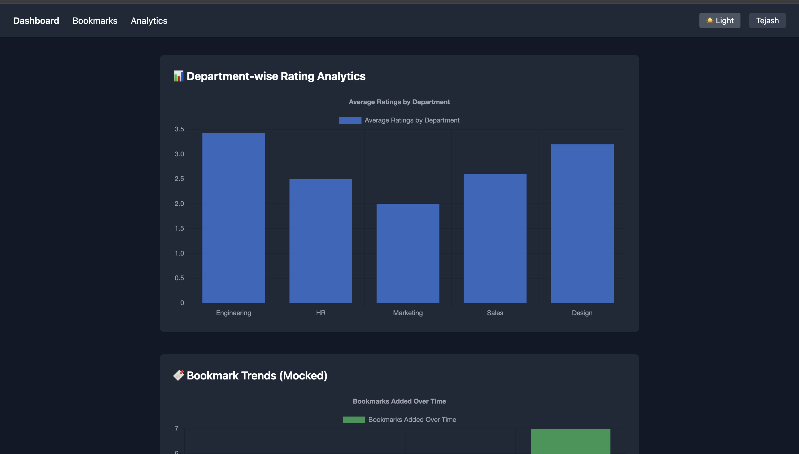
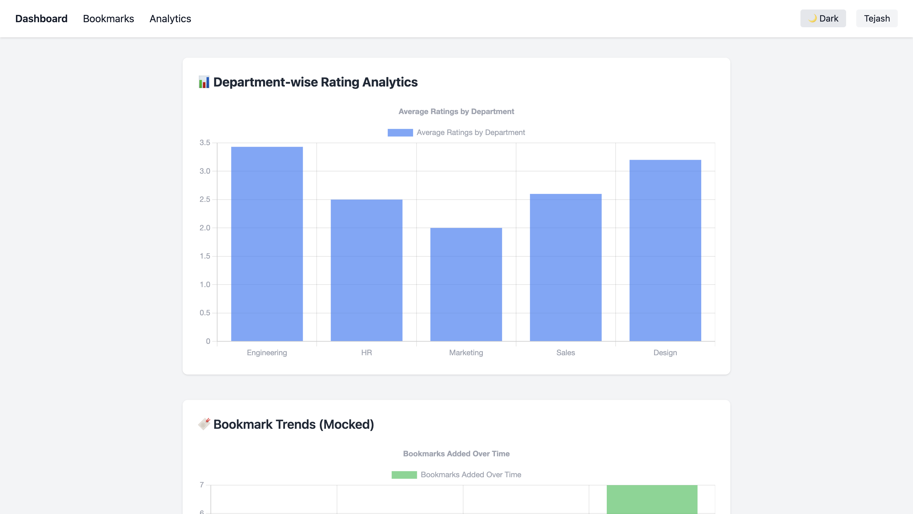

# 💼 HR Dashboard – Performance Management System

**HR Dashboard** is a full-featured HR performance dashboard built with modern web tools including **Next.js (App Router)**, **Tailwind CSS**, **Zustand**, **Chart.js**, and **NextAuth.js**. It offers HR managers a seamless and intuitive interface for managing employee data, tracking performance, bookmarking profiles, and viewing actionable analytics.

---

## 🚀 Why HR Dashboard?

* ✅ Employee management with real-time filters and pagination
* ✅ Bookmarking and promoting employees with toast notifications
* ✅ Dark mode, skeleton loaders, and animation transitions
* ✅ Google OAuth + Credential-based authentication (NextAuth.js)
* ✅ Visual analytics for department-wise performance and bookmark trends

---

## 📌 Features

### 🏠 Dashboard Homepage (`/dashboard`)

* Fetches employee data from [dummyjson.com](https://dummyjson.com/users?limit=20)
* Randomized department and performance rating
* Cards display: Name, Email, Age, Department, Rating Stars
* Actions: View Details, Bookmark, Promote

### 🔍 Search & Filter

* 🔎 Real-time search by name, email, or department
* 🏢 Multi-select department filter
* ⭐ Multi-select rating filter (1–5 stars)

### 👤 Employee Details Page (`/employee/[id]`)

* Full user profile with email, phone, department, bio, etc.
* Tabbed interface: Overview, Projects, Feedback
* Feedback form with validation and toast notifications

### 📌 Bookmark Manager (`/bookmarks`)

* Displays all bookmarked employees
* Features to remove bookmarks and promote directly

### 📊 Analytics (`/analytics`)

* Chart.js-based visualizations:

  * 📈 Department-wise average rating chart
  * 📉 Weekly bookmark trends (mocked)

### 🔐 Authentication

* Google OAuth and Custom Credentials login
* Toggle between Sign In and Register
* Session-based route protection

### ➕ Create User Modal

* Add new employees with modal form
* Form validation and toast confirmation

---

## 🧰 Tools Used

* **Next.js App Router** – Routing and page rendering
* **React 18+** – Component-based UI
* **Tailwind CSS** – Utility-first styling
* **Zustand** – Lightweight global state management
* **NextAuth.js** – Authentication with Google OAuth and Credentials
* **Chart.js** – Analytics and performance visualization
* **Framer Motion** – Smooth tab transitions
* **React Hot Toast** – UX feedback notifications

---

## 📁 Folder Structure

```
hr-dashboard-next/
├── app/                  # App Router pages
│   ├── page.tsx         # Root route (redirects to login)
│   ├── dashboard/       # Dashboard view
│   ├── analytics/       # Analytics charts
│   ├── auth/            # Login/Register routes
│   └── employee/[id]/   # Dynamic employee profile
├── components/          # Navbar, Card, Modals, Charts
├── hooks/               # useSearch, useDebounce
├── lib/                 # mock data, authOptions
├── store/               # Zustand store (bookmarks)
├── public/              # Static assets (screenshots)
├── styles/              # Tailwind CSS styles
├── .env.local           # Environment variables (local dev)
└── README.md            # Project documentation
```

---

## 📸 Screenshots

> These images are stored in `/public/screenshots/`

* **Login/Register**
  
* **Dashboard**
  
* **Bookmarks**
  
* **Employee Details**
  
* **Analytics (Dark + Light)**
  
  

---

## ⚙️ Setup Instructions

### 🔹 Clone the Repo

```bash
git clone https://github.com/tejash05/hr-dashboard-next.git
cd hr-dashboard-next
```

### 🔹 Install Dependencies

```bash
npm install
```

### 🔹 Configure `.env.local`

```env
GOOGLE_CLIENT_ID=your_google_client_id
GOOGLE_CLIENT_SECRET=your_google_client_secret
NEXTAUTH_SECRET=your_nextauth_secret
NEXTAUTH_URL=https://hr-dashboard-next.onrender.com
```

### 🔹 Run Locally

```bash
npm run dev
```

---

## 🔐 Authentication Setup

* **Google Console OAuth Redirect URI:**

  ```
  [https://hr-dashboard-next.onrender.com/api/auth/callback/google](https://hr-dashboard-next.onrender.com/api/auth/callback/google)

  ```

- **JavaScript Origin:**

```
[https://hr-dashboard-next.onrender.com](https://hr-dashboard-next.onrender.com)

```
- **NextAuth Strategy:** JWT mode (no database)


---

## 🌐 Live Demo

> 🔗 [https://hr-dashboard-next.onrender.com](https://hr-dashboard-next.onrender.com)

---

## ✨ Contributor

- **Name:** Tejash Tarun  
- **Role:** Full Stack Developer | UI/UX | State & Auth Logic

---

## ✅ Advanced Features Implemented
```
| Feature | Status |
|--------|--------|
| Responsive UI | ✅ |
| Dark/Light Mode | ✅ |
| Protected Routes | ✅ |
| Zustand Global State | ✅ |
| Auth (Google + Credentials) | ✅ |
| Chart.js Integration | ✅ |
| Add New Users | ✅ |
| Framer Motion Transitions | ✅ |
| Search + Filters | ✅ |
| Bookmark + Promote Actions | ✅ |
| Feedback Modal + Toast | ✅ |

> ✅ Everything from the challenge brief has been implemented + enhancements.

```
